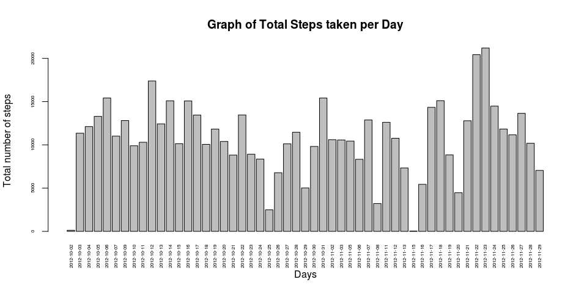
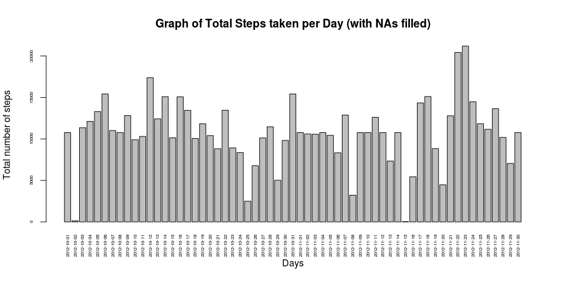

# Reproducible Research: Peer Assessment 1
Rui Mendes  
January 2015  

---

#### Loading and preprocessing the data

###### Loading the csv file (using `read.csv` method) into a data.frame `activityData`.  


```r
## Loading the data
activityData <- read.csv("data/activity.csv")
```

#### Exploring and summarizing the loaded data
See a little sample of the data and class of all data columns in order to find out what transformations need to be done.  
Also checking the number of `NAs` in the steps column

```r
## List the first 5 elements
head(activityData, 5)
```

```
##   steps       date interval
## 1    NA 2012-10-01        0
## 2    NA 2012-10-01        5
## 3    NA 2012-10-01       10
## 4    NA 2012-10-01       15
## 5    NA 2012-10-01       20
```

```r
## List the last 5 elements
tail(activityData, 5)
```

```
##       steps       date interval
## 17564    NA 2012-11-30     2335
## 17565    NA 2012-11-30     2340
## 17566    NA 2012-11-30     2345
## 17567    NA 2012-11-30     2350
## 17568    NA 2012-11-30     2355
```

```r
## Checking the summary of all data columns
summary(activityData)
```

```
##      steps                date          interval     
##  Min.   :  0.00   2012-10-01:  288   Min.   :   0.0  
##  1st Qu.:  0.00   2012-10-02:  288   1st Qu.: 588.8  
##  Median :  0.00   2012-10-03:  288   Median :1177.5  
##  Mean   : 37.38   2012-10-04:  288   Mean   :1177.5  
##  3rd Qu.: 12.00   2012-10-05:  288   3rd Qu.:1766.2  
##  Max.   :806.00   2012-10-06:  288   Max.   :2355.0  
##  NA's   :2304     (Other)   :15840
```

```r
## Checking the class of all data columns
str(activityData)
```

```
## 'data.frame':	17568 obs. of  3 variables:
##  $ steps   : int  NA NA NA NA NA NA NA NA NA NA ...
##  $ date    : Factor w/ 61 levels "2012-10-01","2012-10-02",..: 1 1 1 1 1 1 1 1 1 1 ...
##  $ interval: int  0 5 10 15 20 25 30 35 40 45 ...
```

```r
## Checking the number of NAs in the steps column
table(is.na(activityData$steps))
```

```
## 
## FALSE  TRUE 
## 15264  2304
```


#### Process/transform the data into a format suitable for our analysis
As we saw in the last step, the date colum must to be converted to date format

```r
## Convert 'steps' column to numerical
steps_as_numeric <- as.numeric(activityData$steps)
activityData[,1] <- steps_as_numeric

## Convert 'date' column to Date type
date_as_date <- as.Date(activityData$date)
activityData[,2] <- date_as_date

## Convert 'interval' column to numerical
interval_as_numeric <- as.numeric(activityData$interval)
activityData[,3] <- interval_as_numeric

## Check the interval of dates of teh study
min(activityData$date)
```

```
## [1] "2012-10-01"
```

```r
max(activityData$date)
```

```
## [1] "2012-11-30"
```

#### What is mean of total number of steps taken per day?
For this part of the assignment, we can ignore the missing values in the dataset.
 
 1. Make a histogram of the total number of steps taken each day
 

```r
## Aggregate number of steps per each day using sum function
stepsPerDay <- aggregate(steps ~ date, data = activityData, FUN = sum, na.action=na.omit)

## Plot the histogram of the total number of steps taken each day
barplot(stepsPerDay$steps, main="Graph of Total Steps taken per Day", names.arg = stepsPerDay$date, 
        xlab = "Days", ylab = "Total number of steps", las=3, cex.axis=0.5, cex.names=0.5)
```

 

 2. Calculate and report the mean and median total number of steps taken per day

```r
## Calculate the mean of total number of steps taken per day
mean(stepsPerDay$steps)
```

```
## [1] 10766.19
```

```r
## Calculate the median of total number of steps taken per day
median(stepsPerDay$steps)
```

```
## [1] 10765
```

#### What is the average daily activity pattern?
 1. Make a time series plot (i.e. type = "l") of the 5-minute interval (x-axis) and the average number of steps taken, averaged across all days (y-axis)
 

```r
## Aggregate te number of steps per interval using the mean function
stepsByInterval <- aggregate(steps ~ interval, data = activityData, FUN = mean, na.action=na.omit)
## Make the series plot of Average Steps against Interval
plot(stepsByInterval, type = "l", main="Time-Series of Average Steps against Interval", xlab="5-minute Interval",
      ylab="Average Steps (average across all days)")
```

 

  2. Which 5-minute interval, on average across all the days in the dataset, contains the maximum number of steps?

```r
## Calculate 5-minute interval that contains the maximum number of steps
stepsByInterval$interval[which.max(stepsByInterval$steps)]
```

```
## [1] 835
```


#### Imputing missing values
The presence of missing days may introduce bias into some calculations or summaries of the data.
 
 1. Calculate and report the total number of missing values in the dataset (i.e. the total number of rows with NAs)
 

```r
## Total of NA's values in the dataset
sum(is.na(activityData))
```

```
## [1] 2304
```

 2. Devise a strategy for filling in all of the missing values in the dataset. The strategy does not need to be sophisticated. For example, you could use the mean/median for that day, or the mean for that 5-minute interval, etc.
 
I intend to use the means for the 5-minute intervals as fillers for missing values
 
 3. Create a new dataset that is equal to the original dataset but with the missing data filled in.
Now, using the filled data set, let's make a histogram of the total number of steps taken each day and calculate the mean and median total number of steps. 

```r
## Create a new dataset with missing data flled in
activityDataNAsFilled <- merge(activityData, stepsByInterval, by = "interval", suffixes = c("", 
    ".y"))
nas <- is.na(activityDataNAsFilled$steps)
activityDataNAsFilled$steps[nas] <- activityDataNAsFilled$steps.y[nas]
activityDataNAsFilled <- activityDataNAsFilled[, c(1:3)]

## Check the total number of NA values
sum(is.na(activityDataNAsFilled))
```

```
## [1] 0
```

 4. Make a histogram of the total number of steps taken each day and Calculate and report the mean and median total number of steps taken per day. Do these values differ from the estimates from the first part of the assignment? What is the impact of imputing missing data on the estimates of the total daily number of steps?
 

```r
## Aggregate number of steps per each day using sum function (NAs filled)
stepsPerDayNAsFilled <- aggregate(steps ~ date, data = activityDataNAsFilled, FUN = sum)

## Plot the histogram of the total number of steps taken each day (NAs filled)
barplot(stepsPerDayNAsFilled$steps, main="Graph of Total Steps taken per Day (with NAs filled)", 
        names.arg = stepsPerDayNAsFilled$date, xlab = "Days", ylab = "Total number of steps",
        las=3, cex.axis=0.5, cex.names=0.5)
```

 

```r
## Calculate the mean of total number of steps taken per day (NAs filled)
mean(stepsPerDayNAsFilled$steps)
```

```
## [1] 10766.19
```

```r
## Calculate the median of total number of steps taken per day (NAs filled)
median(stepsPerDayNAsFilled$steps)
```

```
## [1] 10766.19
```
The impact of the missing data seems to be very small, at least when estimating the total number of steps per day.

#### Are there differences in activity patterns between weekdays and weekends?

 1. Create a new factor variable in the dataset with two levels – “weekday” and “weekend” indicating whether a given date is a weekday or weekend day.

```r
## Function to check if date day beongs to the week or weekend
dayType <- function(date) {
    ## My system was in Portugues, so I had to add weekend days in portuguese
    if (weekdays(as.Date(date)) %in% c("Saturday", "Sunday", "Sábado", "Domingo")) {
        "weekend"
    } else {
        "weekday"
    }
}

## Populate day_type column with the correct day type (weekend or weekday)
activityData$daytype <- as.factor(sapply(activityData$date, dayType))
```

 2. Make a panel plot containing a time series plot (i.e. type = "l") of the 5-minute interval (x-axis) and the average number of steps taken, averaged across all weekday days or weekend days (y-axis).


```r
## Plot window with 2 rows and 1 column
par(mfrow=c(2,1))
## Create the 2 plots per each type
for (type in c("weekend", "weekday")) {
    stepstype <- aggregate(steps ~ interval, data=activityData,
                            subset=activityData$daytype==type, FUN=mean)
    plot(stepstype, type="l", main=paste("Time-Series of Average Steps against Interval across all", type, "days"),
         xlab="5-minute Interval", ylab="Average Steps (average across all days)")
}
```

 
