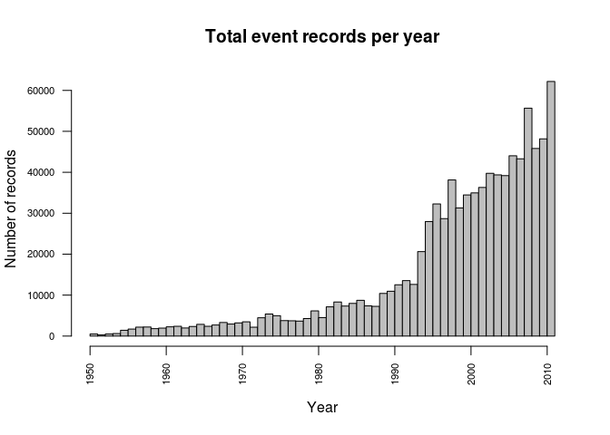
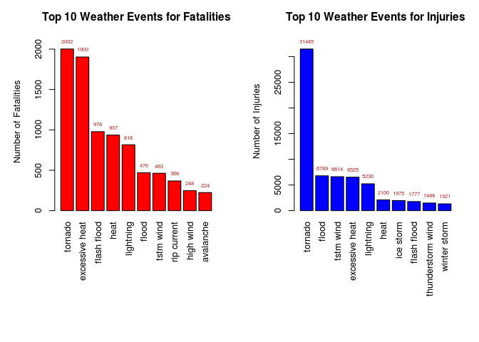
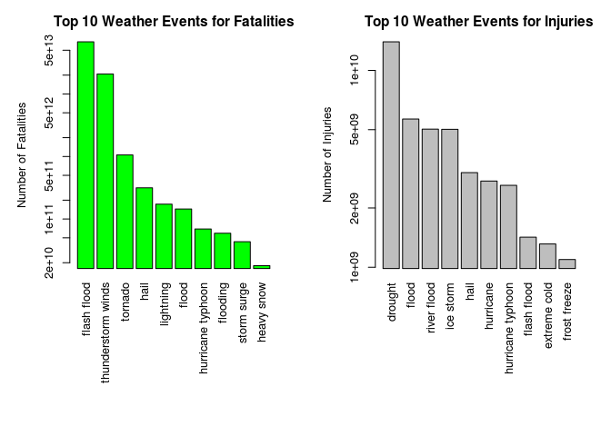

# Health and Economic Impact of Weather Events in the USA
Rui Mendes  
January 2015  
##### Reproducible Research Coursera Course - Peer Assessment 2

---

## Synopsis

This report aims to analyze the impact of different weather events on public health and economy based on the storm database collected from the U.S. National Oceanic and Atmospheric Administration's (NOAA) from 1950 - 2011. 

We will use the estimates of fatalities, injuries, property and crop damage to decide which types of event are most harmful to the population health and economy.

Regarding the total number of records, we will use only the data since 1980.

From these data, we found that excessive heat and tornado are most harmful with respect to population health, while flood, drought, and hurricane/typhoon have the greatest economic consequences.

---

## Data Processing
The analysis was performed on [Storm Events Database](http://www.ncdc.noaa.gov/stormevents/ftp.jsp), provided by National Climatic Data Center. 

The data is on CSV format (a comma-separated-value) and the file is available [here](https://d396qusza40orc.cloudfront.net/repdata%2Fdata%2FStormData.csv.bz2). 

In case of curiosity, there is also some documentation of the data available [here](https://d396qusza40orc.cloudfront.net/repdata%2Fpeer2_doc%2Fpd01016005curr.pdf).

**Note:** For this project we will assume that this data has already been downloaded.


The first step is to read the data and put into a data frame.


```r
## Load dataset from data folder
stormData <- read.csv(bzfile("data/repdata-data-StormData.csv.bz2"))
```


After that let's make a pre-analysis about the dataset (dimension, head, summary, ...)

```r
## First commands to check the first elements of the dataset, a brief summary of the raw data, etc
dim(stormData)
```

```
## [1] 902297     37
```

```r
#head(stormData, n=2)
#str(stormData)
```
There are 902297 rows and 37 columns in total. 


```r
## Start date of the event records
min(as.Date(stormData$BGN_DATE, format = "%m/%d/%Y"))
```

```
## [1] "1950-01-03"
```
The events in the database start in the year 1950 and end in November 2011. 
Let's make a plot to check the total number of records per year.


```r
## Formatting date and time
stormData$year <- as.integer(format(as.Date(stormData$BGN_DATE, "%m/%d/%Y 0:00:00"), "%Y"))

## Plot the total number of records per year
hist(stormData$year, main="Total event records per year", xlab = "Year", ylab = "Number of records", col="grey", breaks=50, las=2, cex.axis=0.7)
```

 

In the earlier years of the database there are generally fewer events recorded, most likely due to a lack of good records. 

More recent years should be considered more complete.

Based on the above histogram, we see that the number of events tracked starts to significantly increase around 1980. So, since now we will use the subset of the data from 1980 to 2011 to get most out of good records.


```r
## Subset the dataset between 1980 and 2011
storm <- stormData[stormData$year >= 1985, ]

## Check the new dimension
dim(storm)
```

```
## [1] 793479     38
```
Now, there are 793479 rows and 38 columns in total.


Let's check the data of the **EVTYPE** column.


```r
## Unique values of EVTYPE column
#unique(stormData$EVTYPE)

## Check the unique number of event types
length(unique(stormData$EVTYPE))
```

```
## [1] 985
```


Before the analysis, the data still need some preprocessing. As we can see in table 2.1.1, there are a list of possible event types (48 types).

And, in the dataset event types don’t have a specific format, they are not clean. For instance, there are events with types Frost/Freeze, FROST/FREEZE and FROST\\FREEZE which obviously refer to the same type of event. 

So, in order to fix this problems we can use lower or upper letters features, replace/remove blank spaces or special characters, etc.


```r
## Translate all letters to lowercase
event_types <- tolower(storm$EVTYPE)

## Replace all punct. characters with a space
event_types <- gsub("[[:blank:][:punct:]+]", " ", event_types)

## Replace all 'thunderstorm winds' and other characters with 'thunderstorm winds'
event_types <- gsub("^thunderstorm wind[:alnum:]", "thunderstorm wind", event_types)
event_types <- gsub("^tstm wind[:alnum:]", "thunderstorm wind", event_types)

## List the lenght of event types
length(unique(event_types))
```

```
## [1] 874
```

```r
# Update the data frame
storm$EVTYPE <- event_types
```


Another optimize that we can do and in order to reduce the data set, and since we are interested in the most harmful and/or with greatest economic consequences events, we will filter the rows whose fields FATALITIES, INJURIES, PROPDMG and CROPDMG are greater than zero.


```r
## Filter the health data 
healthEventsGreaterThanZero <- storm$FATALITIES > 0 | storm$INJURIES > 0
healthData <- storm[healthEventsGreaterThanZero, ]

## Filter the economic data
economicEventsGreaterThanZero <- storm$PROPDMG > 0 | storm$CROPDMG > 0
economicData <- storm[economicEventsGreaterThanZero, ]

## List the new dimensions
dim(healthData)
```

```
## [1] 16970    38
```

```r
dim(economicData)
```

```
## [1] 224257     38
```

This reduce the data to:

 * Health data has 16970 entries
 * Economic data has 224257 entries
 
More transformations should be done, but I think for this propose it's enough. For example, we could merge event types such as tstm wind and thunderstorm wind. After the cleaning, as we expected, the number of unique event types reduce significantly. 

For further analysis, the cleaned event types are used.

---

## Healt and Economic datasets analysis
As indicated above, the main of this study is to produce some advices to “an government or municipal manager who might be responsible for preparing for severe weather events and will need to prioritize resources for different types of events”. So the data is separated in two data sets:

 
  * **healthData** contains entries whose FATALITIES or INJURIES fields are greater than zero.
  * **economicData** contains entries whose `PROPDMG or CROPDMG fields are greater than zero.


### Healt data

To find the event types that are most harmful to population health, the number of casualties are aggregated by the event type.

```r
## Calculate fatalEvents by aggregation
fatalEvents <- aggregate(FATALITIES ~ EVTYPE, data = healthData, FUN = sum)

## Calculate injuryEvents by aggregation
injuryEvents <- aggregate(INJURIES ~ EVTYPE, data = healthData, FUN = sum)

# Find events that caused most death and injury
fatalEventsTop10 <- head(fatalEvents[order(fatalEvents$FATALITIES, decreasing = T), ], 10)
injuryEventsTop10 <- head(injuryEvents[order(injuryEvents$INJURIES, decreasing = T), ], 10)

# Change column names
colnames(fatalEventsTop10) <- c("Event", "Fatalities")
colnames(injuryEventsTop10) <- c("Event", "Injuries")
```


### Economic data

In order to analyze the impact of weather events on the economy, **available property damage** and **crop damage** reportings/estimates were used.

In the raw data, the *property damage* is represented with two fields, a number **PROPDMG** in dollars and the exponent **PROPDMGEXP**. 

Similarly, the *crop damage* is represented using two fields, **CROPDMG** and **CROPDMGEXP**. 

As explained in the section 2.7 of the manual, the database contains the value of damage using non numeric values. For example, B stands for billions and K for thousands. For this reason we will convert the property damage and crop damage values to numerical.


```r
## Calculate the property and crop damage for each event
exponentValueTransform <- function(e) {
    # h -> hundred, k -> thousand, m -> million, b -> billion
    if (e %in% c('h', 'H'))
        return(2)
    else if (e %in% c('k', 'K'))
        return(3)
    else if (e %in% c('m', 'M'))
        return(6)
    else if (e %in% c('b', 'B'))
        return(9)
    else if (!is.na(as.numeric(e))) # if a digit
        return(as.numeric(e))
    else if (e %in% c('', '-', '?', '+'))
        return(0)
    else {
        stop("Invalid exponent value.")
    }
}
```


The next step in the analysis is to calculate the property and crop damage for each event.


```r
## Calculate propDMGExponent
propDMGExponent <- sapply(economicData$PROPDMGEXP, FUN=exponentValueTransform)
economicData$PROPDMG <- economicData$PROPDMG * (10 ** propDMGExponent)

## Calculate cropDMGExponent
cropDMGExponent <- sapply(economicData$CROPDMGEXP, FUN=exponentValueTransform)
economicData$CROPDMG <- economicData$CROPDMG * (10 ** cropDMGExponent)
```


```r
# Compute the economic loss by event type
## Calculate fatalEvents by aggregation
propDMGEvents <- aggregate(PROPDMG ~ EVTYPE, data = economicData, FUN = sum)

## Calculate injuryEvents by aggregation
cropDMGEvents <- aggregate(CROPDMG ~ EVTYPE, data = economicData, FUN = sum)

# Find events that caused most economic expenses
propDMGEventsTop10 <- head(propDMGEvents[order(propDMGEvents$PROPDMG, decreasing = T), ], 10)
cropDMGEventsTop10 <- head(cropDMGEvents[order(cropDMGEvents$CROPDMG, decreasing = T), ], 10)

# Change column names
colnames(propDMGEventsTop10) <- c("Event", "propDMG")
colnames(cropDMGEventsTop10) <- c("Event", "cropDMG")
```


---

## Results


### 1. Across the United States, which types of events (as indicated in the EVTYPE variable) are most harmful with respect to population health?
To answer this question we will present the results divided by fatalities and injuries. 
We will use the fatalEventsTop10 and injuryEventsTop10 datasets created above. 
It was performed an aggregate function to obtain the sum of all fatalities caused by an specific event. From that, we ordered the table in a decreasing order and take the top 10). The same will be done for injuries.


So, top 10 events that caused largest number of deaths are:


```r
print(fatalEventsTop10)
```

```
##              Event Fatalities
## 169        tornado       2002
## 27  excessive heat       1903
## 36     flash flood        978
## 61            heat        937
## 110      lightning        816
## 41           flood        470
## 176      tstm wind        463
## 135    rip current        368
## 82       high wind        248
## 2        avalanche        224
```


And the top 10 events that caused most number of injuries are:


```r
print(injuryEventsTop10)
```

```
##                 Event Injuries
## 169           tornado    31485
## 41              flood     6789
## 176         tstm wind     6614
## 27     excessive heat     6525
## 110         lightning     5230
## 61               heat     2100
## 105         ice storm     1975
## 36        flash flood     1777
## 159 thunderstorm wind     1488
## 198      winter storm     1321
```


In order to make a comparison we will plot both tables using a boxplot.


```r
## Set a 1x2 window
par(mfrow = c(1, 2), mar = c(12, 5, 3, 2), mgp = c(3, 1, 0), cex = 0.8, las = 3)

## FatalPlot
ylim <- c(0, 1.1*max(fatalEventsTop10$Fatalities))
fatalPlot <- barplot(fatalEventsTop10$Fatalities, names.arg = fatalEventsTop10$Event, col = 'red',
        main = 'Top 10 Weather Events for Fatalities', ylab = 'Number of Fatalities', ylim = ylim)
## Add values above each bar
text(x = fatalPlot, y = fatalEventsTop10$Fatalities, label = round(fatalEventsTop10$Fatalities, 0), pos = 3, cex = 0.6, col = "brown")

## Injuryplot
ylim <- c(0, 1.1*max(injuryEventsTop10$Injuries))
injuryPlot <- barplot(injuryEventsTop10$Injuries, names.arg = injuryEventsTop10$Event, col = 'blue',
        main = 'Top 10 Weather Events for Injuries', ylab = 'Number of Injuries', ylim = ylim)
## Add values above each bar
text(x = fatalPlot, y = injuryEventsTop10$Injuries, label = round(injuryEventsTop10$Injuries, 0), pos = 3, cex = 0.6, col = "brown")
```

 

We can see that **tornados** are the principal cause of deaths and injuries among all event types. 
There are more than **2,000 deaths** and more than **30,000 injuries** in the last **30 years in US**, because of the tornados. 

The other event types that are most dangerous with respect to population health are **excessive heat** and **flash floods**.


### 2. Across the United States, which types of events have the greatest economic consequences?

A similar approach as the first question will be use to solve this problem.

Events that caused the most cost in damage to properties.

Here, we will use propDMGEventsTop10 and cropDMGEventsTop10 calculated before.

Top 10 events that caused most property damage (in dollars):


```r
print(propDMGEventsTop10)
```

```
##                  Event      propDMG
## 50         flash flood 6.820237e+13
## 292 thunderstorm winds 2.086532e+13
## 315            tornado 1.058408e+12
## 95                hail 3.157558e+11
## 195          lightning 1.729433e+11
## 63               flood 1.446577e+11
## 173  hurricane typhoon 6.930584e+10
## 68            flooding 5.920826e+10
## 264        storm surge 4.332354e+10
## 127         heavy snow 1.793259e+10
```

Top 10 events that caused biggest crop damage.


```r
print(cropDMGEventsTop10)
```

```
##                 Event     cropDMG
## 31            drought 13972566000
## 63              flood  5661968450
## 231       river flood  5029459000
## 182         ice storm  5022113500
## 95               hail  3025974480
## 165         hurricane  2741910000
## 173 hurricane typhoon  2607872800
## 50        flash flood  1421317100
## 44       extreme cold  1312973000
## 82       frost freeze  1094186000
```


In order to make a comparison we will plot both tables using a boxplot.


```r
## Set a 1x2 window
par(mfrow = c(1, 2), mar = c(12, 5, 3, 2), mgp = c(3, 1, 0), cex = 0.8, las = 3)

## propDMGPlot
propDMGPlot <- barplot(propDMGEventsTop10$propDMG, names.arg = propDMGEventsTop10$Event, col = 'green',
        main = 'Top 10 Weather Events for Fatalities', ylab = 'Number of Fatalities', log="y")

## cropDMGPlot
cropDMGPlot <- barplot(cropDMGEventsTop10$cropDMG, names.arg = cropDMGEventsTop10$Event, col = 'grey',
        main = 'Top 10 Weather Events for Injuries', ylab = 'Number of Injuries', log="y")
```

 

Property damages are given in logarithmic scale due to large range of values.

The data shows that **flash floods** and **thunderstorm winds** cost the largest property damages among **weather-related natural diseasters**. 

The most severe weather event in terms of **crop damage** is the **drought**. In the last 30 years, the drought has caused more than **13 billion dollars** damage.

Other severe crop-damage-causing event types are **floods** and **storms**.


---


## Conclusion

With this study, the government can now keep with the idea where the most expenses were and what are the most causes of fatalities and injuries of the USA population.
From these data, we found that excessive heat and tornado are most harmful with respect to population health, while flood, drought, and thunderstorm winds have the greatest economic consequences.
 
Note that, due to untidy nature of the available data, type flood and flash flood are separate values and should be merged for more accurate data-driven conclusions like other types explained above.

With more data preprocessing tricks I think the results could be better and more accurated, but I think for this purpose is enough.

*Mission accomplished*!!! :D
